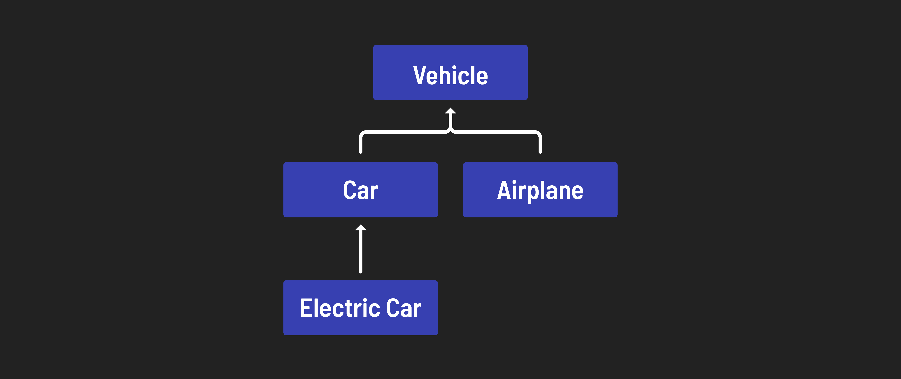
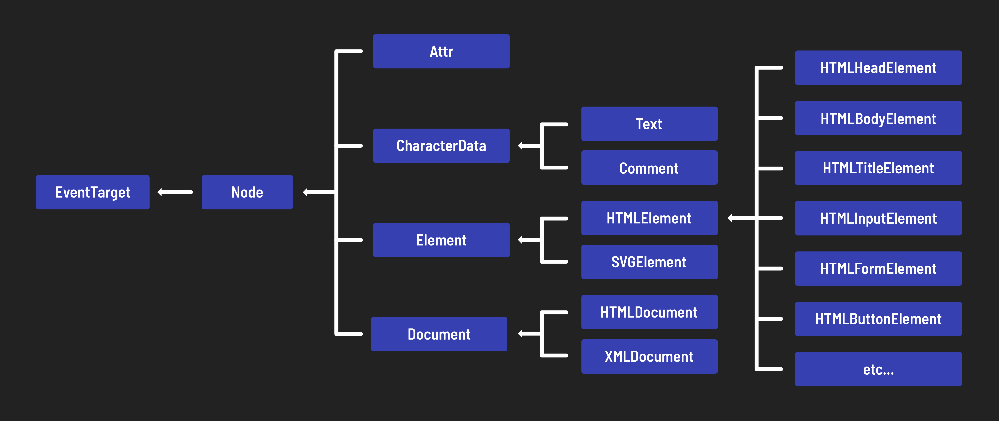

<h1>
  Intro to JavaScript Classes
  Class Hierarchy
</h1>

**Learning objective:** By the end of this lesson, students will understand the benefits and implications of inheritance in building complex systems.

## Class hierarchy

In object-oriented Programming, it's not uncommon to have several layers of inheritance. The term **class hierarchy** refers to the layered structure in which classes are arranged.

Imagine you were to create an `Airplane` class alongside `Car`. The two classes are likely to share several overlapping properties like `make` or `model`. This might warrant creating a new class (perhaps `Vehicle`) to be a superclass of both the `Car` and `Airplane` classes, so that shared properties can be inherited rather than being defined multiple times.

You can start to see how class inheritance may play out in a larger application or system.

Below you can see a simplified class hierarchy for DOM elements:

