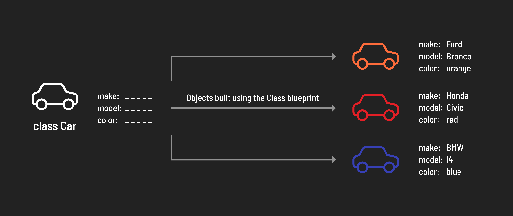

<h1>
  <span class="headline">Intro to JavaScript Classes</span>
  <span class="subhead">Concepts</span>
</h1>

**Learning objective:** By the end of this lesson, students will understand how JavaScript provides classes to create reusable blueprints for objects.

## What are classes?

In JavaScript, classes act as blueprints for creating new objects. These new objects are called *instances* of that class. 

Imagine a class as a detailed template. It defines certain characteristics (properties) and actions (methods) that are common to a group of objects. For instance, a Car class might specify properties like make, model, and color, and a method like drive(). When we create individual cars (instances) from this class, each car inherits these properties and methods, allowing us to assign specific values (e.g., a red Honda Civic) and perform actions (e.g., driving the car).

> 🧠 In the style of [object-oriented programming (OOP)](https://en.wikipedia.org/wiki/Object-oriented_programming), classes offer a clear and efficient way to create reusable parts of an application. 



> 📚 An *instance* is an object produced by a class, containing all of the properties and behaviors defined by that class.

## Encapsulation in OOP

Classes provide a clear and structured way to encapsulate and manage related data and functionality. [Encapsulation](https://en.wikipedia.org/wiki/Encapsulation_(computer_programming)) is a key principle of Object Oriented Programming. It is the concept of bundling data (properties/attributes) and related behavior (methods) **within an object**.

Let's build on this idea using the cars in the example above. Consider the following three attributes:

1. `make`
2. `model`
3. `color`

On their own these attributes do not have much context. However, it makes sense to group (encapsulate) these attributes together to collectively describe characteristics of the same entity: a car.

Let's write out how those properties might be represented using object literal notation:

```js
const myFirstCar = {
  make: 'Toyota',
  model: 'Corolla',
  color: 'black',
};
```

### What other attributes might a car have?

What about the **behavior** of a car? What can a car do? What can you do with a car? Let's start with the basics - a car needs to start, right? A `start()` method will do nicely then.

As you add behaviors you may also decide to create new attributes for a car - a `start()` method won't help us much unless we're also tracking if a car is currently running, so we should also create an `isRunning` attribute to support that behavior.

Let's add those to our object above:

```javascript
const myFirstCar = {
  make: 'Toyota',
  model: 'Corolla',
  color: 'black',
  isRunning: false,
  start: function() {
    myFirstCar.isRunning = true;
    console.log('Running!');
  },
};
```

## Why use classes?

In JavaScript, objects can be created using object literal notation, so why are classes necessary?

Continuing from our example above - imagine we are building an application for a car dealership. We want to track their inventory of cars and make modifications over time. We can't possibly know the make, model, and color of every car that the car dealership will ever sell when we build the application.

Without classes, we would have to add a new object literal in the application's code every time the dealership buys a new car. A more efficient approach can be taken with classes. We can construct a `Car` class that defines the basic structure of a car. In this example, every instance of a car has a `make`, `model`, and a `color`.
