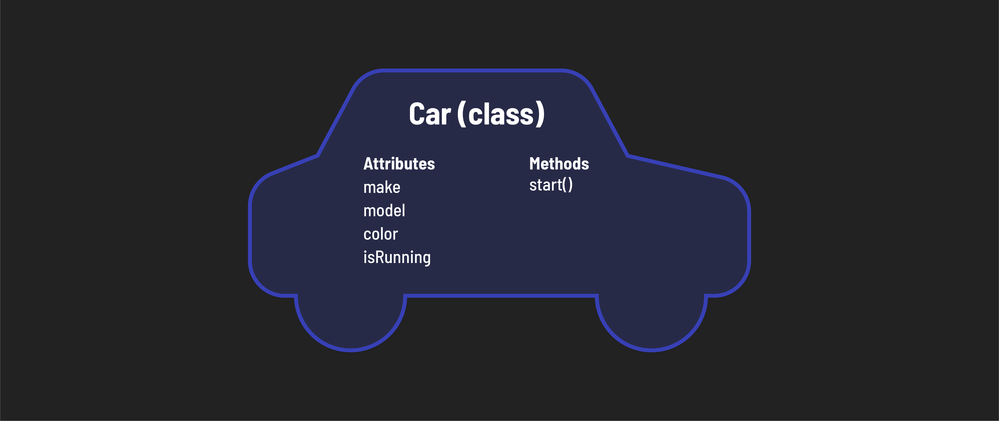

<h1>
  <span class="headline">Intro to JavaScript Classes</span>
  <span class="subhead">Defining and Instantiating a Class</span>
</h1>

**Learning objective:** By the end of this lesson, students will be able to define and instantiate classes in JavaScript.

## Defining a class



In JavaScript, we define a class using the [class](https://developer.mozilla.org/en-US/docs/Web/JavaScript/Reference/Statements/class) keyword:

```js
class Car {
  // Code to define the class's properties and methods
};
```

Take a look at the syntax used above. It might remind you of the syntax used for defining functions, and rightly so, as classes in JavaScript are essentially special types of functions. However, there are some notable differences between the two, particularly in their naming conventions. Classes are typically written using *PascalCase* (capitalizing the first letter of each word), whereas functions are often written in *camelCase* (starting with a lowercase letter and capitalizing each subsequent word).

> 🧠 Although we haven't added any properties or methods to the class, we can still create an object (instance) from it, though it wouldn't be particularly functional or useful.

## Instantiating a class

The term **instantiation** refers to the process of creating a new object from a class. This newly created object is known as an **instance**. When we instantiate a class, the instance we create inherits all the properties and behaviors defined in that class.

In JavaScript, instances are created using the `new` keyword, followed by the name of the class.

Let's create a `myCar` object:

```js
const myCar = new Car();
```

> 💡 Notice how instantiating a class resembles calling a function, using the `new` keyword, followed by the class name and parentheses.

If we try to view our new car object in the console, we'll see that it doesn't have any properties yet. 

```js
console.log(myCar)
// Car {}
```

### The `constructor` method

When a class is instantiated, its [constructor](https://developer.mozilla.org/en-US/docs/Web/JavaScript/Reference/Classes/constructor) method is called **automatically**. The `constructor` is a special method defined within the class.

In the `constructor` method, you can **define the initial values for the object's properties**. These properties are attached to the object using the `this` keyword:

```js
class Car {
  constructor(make, model) {
    this.make = make;
    this.model = model;
    // return is not needed
    // because the new object is returned by default
  }
};
```

In this example, `make` and `model` are parameters passed to the `constructor` and are used to set the initial values of the `make` and `model` properties on each new `Car` instance.

Now when we create a new instance, we can define its initial values by passing arguments to the `constructor`:

```js
const myCar = new Car('Ford', 'Bronco');
console.log(myCar); // { make: "Ford", model: "Bronco" }
```

Not every property of a class requires a parameter in the constructor. If a property should have the same default value for every instance, you can directly assign it within the constructor.

For example, let's make sure a car isn't running when we build it:

```js
class Car {
  constructor(make, model) {
    this.make = make;
    this.model = model;
    this.isRunning = false; // default to false
  }
};
```

With this setup, every `Car` instance we create will have `isRunning` set to `false` by default, without needing to pass this as a parameter to the constructor everytime.

### What is `this`?

The word `this` in JavaScript might seem a bit confusing at first, but it's actually very useful once you understand its function. Think of `this` as a special word that helps you access things inside the object you're currently working with.

Imagine you're inside a car. If you say, "Start *this* car," you mean the car you're in, right? Similarly, when you're inside a JavaScript object (like a class), `this` refers to *that* object.

Key notes about `this`:

- `this` is known as a *keyword* in JavaScript, available for use inside of functions or methods (like our `constructor` above). 

- The `this` keyword is a part of a function's *execution context*, which includes the code and everything that aids in its execution.

- `this` changes depending on which object is using the method.

All object-oriented programming languages use a keyword like `this` to:

1. Access an object's own properties: Inside an object's method , `this` lets you access other properties or methods of the same object. It's like saying, "In *this* house, turn on *this* light."

2. Reuse Code: Sometimes, you want to write a method that you can use in different objects. `this` helps these methods work correctly no matter which object uses them, because `this` will always refer to the object that's currently using the method.

Lastly, the value of `this` is automatically set by the JavaScript engine when a function is invoked. The act of setting that value is known as *binding* and although we can *change* the value of `this`, doing so is not common.

### Object Creation - behind the scenes

When you create an object from a class in JavaScript using the new keyword, several steps happen in the background:

1. JavaScript creates a shiny new empty object and assigns it to the `this` keyword.

2. The class's `constructor` method is called automatically. The arguments you pass when creating a new object are fed into this `constructor`.

3. Inside the `constructor`, properties are assigned to the new object using `this`.

4. The class automatically returns the shiny new object.

> Although the `constructor` method appears unique because it's called automatically, there's nothing special about how it's defined; other methods are defined the same way.


Grasping `this` can be challenging at first, but with practice and examples, it becomes clearer. For now, what's most important to remember is **`this` in a class constructor is a reference to the new object being created.** It's a placeholder for the object's name, which isn't known until the class creates the object. 

### 🎓 You Do 

Add another property, and instantiate the class.

1. Modify the `Car` class by adding a property named `color`. Don't forget to add a new parameter to the `constructor` method.

2. Test it by instantiating another object of your choice. It should resemble the one below - you should add this line to your code as well; we'll use it later in this lesson.

    ```js
    const mySubaru = new Car('Subaru', 'Crosstrek', 'blue')
    ```