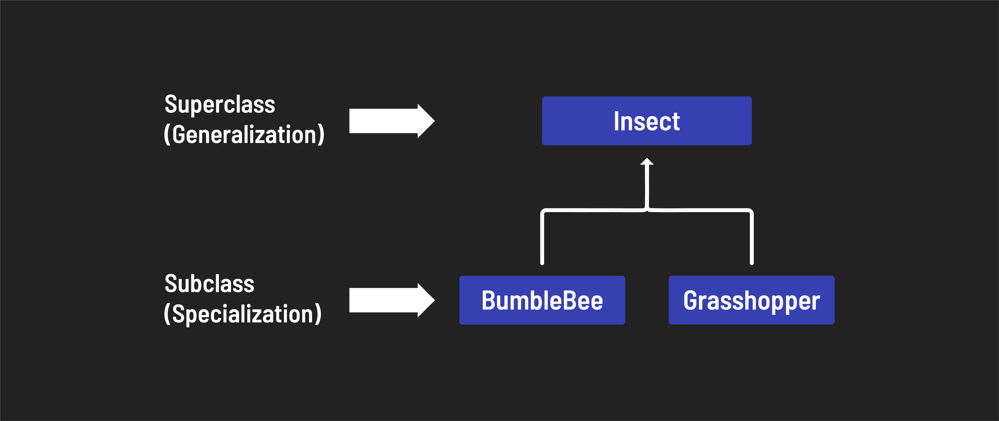
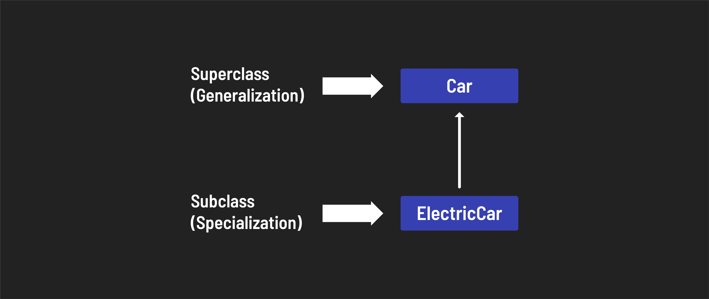

<h1>
  <span class="headline">Intro to JavaScript Classes</span>
  <span class="subhead">Inheritance</span>
</h1>

**Learning objective:** By the end of this lesson, students will understand the concept of inheritance in object-oriented programming.

## What is inheritance?

In object-oriented programming, inheritance is a concept where a new class (known as a child or *derived class*) acquires, or inherits, attributes and behaviors (properties and methods) from an existing class (known as a parent or base class). This allows the child to use and, if necessary, modify or extend the functionalities of the parent class.

The newly derived class can be specialized by:

- Adding additional properties.
- Adding additional methods.
- Overriding existing methods.

> 📚 The newly derived class is called a *derived* or *subclass* while the original class is called a *base* or *superclass*.

A subclass automatically inherits all of the superclass's properties and methods - whether you want them all or not.



Above, the `Insect` superclass has the `BumbleBee` and `Grasshopper` subclasses derived from it.

We're going to add a subclass called `ElectricCar` that will be derived from the `Car` superclass! Here's a diagram showing the relationship we will create.



## Using the `extends` keyword to create a subclass

We use the `extends` keyword to define a subclass.

```js
class ElectricCar extends Car {
  constructor(make, model, color, batteryCharge) {
    super(make, model, color);
    this.batteryCharge = batteryCharge;
  }
};
```

In a derived class, the [super](https://developer.mozilla.org/en-US/docs/Web/JavaScript/Reference/Operators/super) keyword represents the **parent superclass** and must be called before the `this` keyword can be used in the constructor. It can also be used to access properties of the superclass.

Additional properties like `batteryCharge` above can be initialized in the `constructor`. Instances of `ElectricCar` will have a `batteryCharge` property, while instances of `Car` will not. Let's build an electric car!

```js
const myVolvo = new ElectricCar('Volvo', 'EX30', 'Gray', 100); // Fully charged!
```

Determining which classes in a hierarchy to attach properties and methods to is difficult work, full of pitfalls and gotchas. This is one of the biggest hurdles to overcome when you're getting started with inheritance - it won't always be as clear-cut as it is above!

## Overriding methods

A derived class can also override methods defined on the parent superclass. Let's use this principle to modify the inherited `start` method for the `ElectricCar` class:

```js
class ElectricCar extends Car {
  constructor(make, model, color, batteryCharge) {
    super(make, model, color);
    this.batteryCharge = batteryCharge;
  }
  start() {
    if (this.batteryCharge > 0) {
      this.isRunning = true;
      console.log('Your electric car is running!');
    } else {
      this.isRunning = false;
      console.log('Time to recharge!');
    };
  }
};
```

Next, we'll start up the electric car, quickly deplete the battery, and try to restart it:

```js
myVolvo.start() // "Your electric car is running!"
myVolvo.batteryCharge = 0
myVolvo.start() // "Time to recharge!"
```

### Overriding prototype methods

In JavaScript, inheritance is a bit different compared to traditional object-oriented programming languages like Java or Python. In JavaScript, inheritance is based on prototypes rather than class-based hierarchies.

However, with the introduction of the class syntax in modern JavaScript, understanding prototypes isn't as crucial for this lesson.

At the root of JavaScript's inheritance hierarchy is the `Object` class. Almost every object in JavaScript is an instance of `Object` and inherits methods from `Object.prototype`.

For instance, the [toString](https://developer.mozilla.org/en-US/docs/Web/JavaScript/Reference/Global_Objects/Object/toString) method is a common method that every object inherits:

```js
const mySubaru = new Car('Subaru', 'Crosstrek', 'blue');

console.log(mySubaru.toString()); // "[object Object]"
```

This default `toString` method isn't very descriptive, so often, you'll want to override it to make it more useful. 

For example, we can override `Object`'s implementation of `toString` by defining it in our `Car` class:

```js
class Car {
  // the constructor will always be called
  constructor(make, model, color) {
    this.make = make;
    this.model = model;
    this.color = color;
    this.isRunning = false;
  }
  start() {
    this.isRunning = true;
    console.log('Running!');
  }
  static about() {
    console.log('I\'m the Car class!');
  }
  // override a prototype method
  toString() {
    return `This car is a ${this.color} ${this.make} ${this.model}.`;
  }
};
```

Now when we call the `toString()` method on `mySubaru`, we should see the defined output:

```js
const mySubaru = new Car('Subaru', 'Crosstrek', 'blue');

console.log(mySubaru.toString()); // "This car is a blue Subaru Crosstrek"
```

So far, you've learned how to define a class that creates objects with properties and add prototype methods. This represents about 80% of what there is to know about classes - congrats!